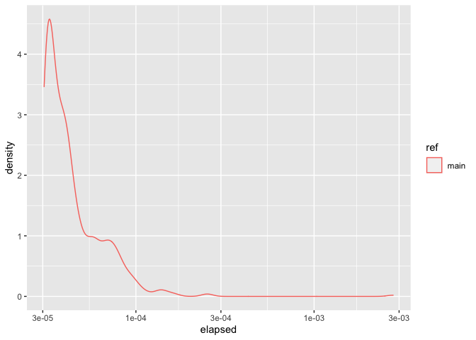

# touchstone

touchstone is a tool for continuous benchmarking.

<!-- badges: start -->

[](https://www.tidyverse.org/lifecycle/#experimental)
[](https://github.com/lorenzwalthert/touchstone/actions)
<!-- badges: end -->

## Installation

You can install the package from GitHub:

``` r
# install.packages("devtools")
devtools::install_github("lorenzwalthert/touchstone")
```

## Motivation

The motivation for touchstone is to provide accurate benchmarking
results for package developers. The following insights were the
motivation:

-   Often, it does not make sense to only benchmark the feature branch
    and compare this result with a CI/CD run that only benchmarked th
    master branch, because compute power available in GitHub Actions
    generally varies too much. The solution to this is to benchmark the
    two branches in one CI/CD run and look at *relative difference*
    between branches. This matters in particular when running one
    iteration of a benchmark takes long (&gt;&gt; a few seconds) and
    speed implications are small. Experience with styler showed that a
    variation [around 30%](https://github.com/r-lib/styler/pull/679) for
    identical benchmarking code is not unusual.

-   Maintaining a timeline such as the implementation of r-lib/bench is
    of limited use because of the first bullet. Speed implications are
    to be checked between two revisions.

-   R and package versions must be fixed via RSPM to allow as much
    continuation as possible anyways. Changing the timestamp of RSPM can
    happen in PRs that are only dedicated to dependency updates.

## Proposed Workflow

touchstone makes it easy for you to

-   select a branch in your package root and built the package.

-   run code to benchmark.

-   iterate over the above with random order of the branches you want to
    compare.

See the example below.

## Example

This is a basic example which shows you how to solve a common problem:

``` r
library(touchstone)
library(magrittr)
## basic example code
timings <- benchmark_run_ref(
  refs = "main", name_of_benchmark = "runif(100)", n = 2
)
#> ✓ Switched to branch main.
#> ✓ Installed branch main.
#> ✓ Ran 20 iterations of ref `main`.
#> ✓ Switched to branch main.
#> ✓ Installed branch main.
#> ✓ Ran 20 iterations of ref `main`.

timings %>%
  ggplot2::ggplot(ggplot2::aes(.data$elapsed, color = .data$ref)) +
  ggplot2::scale_x_continuous(trans = "log10") +
  ggplot2::geom_density()
```



``` r
# retrieve later
benchmark_read("name_of_benchmark", "main")
#> # A tibble: 54 x 4
#>      elapsed iteration ref   name             
#>        <dbl>     <int> <chr> <chr>            
#>  1 0.0000700         1 main  name_of_benchmark
#>  2 0.000210          2 main  name_of_benchmark
#>  3 0.000117          3 main  name_of_benchmark
#>  4 0.0000992         4 main  name_of_benchmark
#>  5 0.0000691         5 main  name_of_benchmark
#>  6 0.0000799         6 main  name_of_benchmark
#>  7 0.0000720         7 main  name_of_benchmark
#>  8 0.0000674         8 main  name_of_benchmark
#>  9 0.0000571         9 main  name_of_benchmark
#> 10 0.0000703        10 main  name_of_benchmark
#> # … with 44 more rows
```

Touchstone switches to branch `main` of this package, builds it and run
an expression to benchmark. In a real-world scenario, you would:

-   Select multiple branches instead of just `main`. Benchmarking code
    will be ran on all of them, multiple times, in random order.

-   use a function that is exported from the package namespace you want
    to benchmark, because otherwise you would not be able to measure the
    performance difference between different branches.

-   use a different name than `name_of_benchmark` in the function call.
    We support dynamic dots from `{rlang}` for the benchmarking
    expression.

## Status

This package is experimental. It is currently used in
[styler](https://github.com/r-lib/styler/blob/master/.github/workflows/benchmarking.yaml).
We’ll further reduce boilerplate code required in the GitHub Actions
workflow file and move it to `{touchstone}`.
