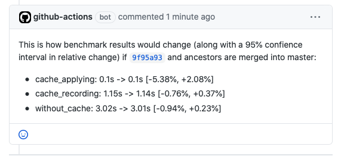

# touchstone

touchstone is a tool for continuous benchmarking, in particular useful
for estimating speed implications of a pull request.

<!-- badges: start -->

[](https://www.tidyverse.org/lifecycle/#experimental)
[](https://github.com/lorenzwalthert/touchstone/actions)
<!-- badges: end -->

## Installation

You can install the package from GitHub:

``` r
# install.packages("devtools")
devtools::install_github("lorenzwalthert/touchstone")
```

## Conceptual

For your PR branch and the target branch:

-   build the repo.

-   define code you want to benchmark, run it multiple times.

-   Create c/p ready text (because commenting on the PR is not so easy
    to implement) that you can manually insert in the PR description and
    plots that show how the distribution of the timings for both
    branches.



## Motivation

The motivation for touchstone is to provide accurate benchmarking
results for package developers. The following insights were the
motivation:

-   Often, it does not make sense to only benchmark the feature branch
    and compare this result with a CI/CD run that only benchmarked th
    master branch, because compute power available in GitHub Actions
    generally varies too much. The solution to this is to benchmark the
    two branches in one CI/CD run and look at *relative difference*
    between branches. This matters in particular when running one
    iteration of a benchmark takes long (&gt;&gt; a few seconds) and
    speed implications are small. Experience with styler showed that a
    variation [around 30%](https://github.com/r-lib/styler/pull/679) for
    identical benchmarking code is not unusual.

-   Maintaining a timeline such as the implementation of r-lib/bench is
    of limited use because of the first bullet. Speed implications are
    to be checked between two revisions.

-   R and package versions must be fixed via RSPM to allow as much
    continuation as possible anyways. Changing the timestamp of RSPM can
    happen in PRs that are only dedicated to dependency updates.

## Proposed Workflow

touchstone makes it easy for you to benchmark PRs. Initialize it in your
repo with

``` r
touchstone::use_touchstone()
```

This will:

-   write `.github/workflows/touchstone.yaml`: The github actions
    workflow file.
-   create a `touchstone` directory in the repo root with:
    -   `config.json` that defines how to run your benchmark. In
        particular, you can define a benchmarking repo, that is, code
        you need to run your bench mark. The code you want to benchmark
        comes from the benchmarked repo, which in our case is the root
        from where you call `use_touchstone()` and hence does not need
        to be defined explicitly.

    ``` json
    {
      "benchmarking_repo": "lorenzwalthert/here",
      "benchmarking_ref": "ca9c8e69c727def88d8ba1c8b85b0e0bcea87b3f",
      "benchmarking_path": "touchstone/sources/here",

      "os": "ubuntu-18.04",
      "r": "4.0.0",
      "rspm": "https://packagemanager.rstudio.com/all/__linux__/bionic/291"
    }
    ```

    -   `script.R`, the script that runs the benchmark. The below code
        will run the benchmarking expression `runif(100)`, give it the
        name `random_test`, and do this twice in total (once for each
        branch).

    ``` r
    touchstone::benchmark_run_ref(
    random_test = "runif(100)", n = 2
    )
    ```

This is not particularly useful, since `runif()` is not a function from
the benchmarked repo. You want to bench mark functions from your package
(that don’t have the same source code in both branches). The script
should contain a call to `touchstone::benchmarks_analyse()` at the end
to write the required artifacts that are used downstream in the GitHub
Actions workflow.

## Status

This package is experimental. It is currently used in
[styler](https://github.com/r-lib/styler/blob/master/.github/workflows/benchmarking.yaml).
We’ll further reduce boilerplate code required in the GitHub Actions
workflow file and move it to `{touchstone}`.
